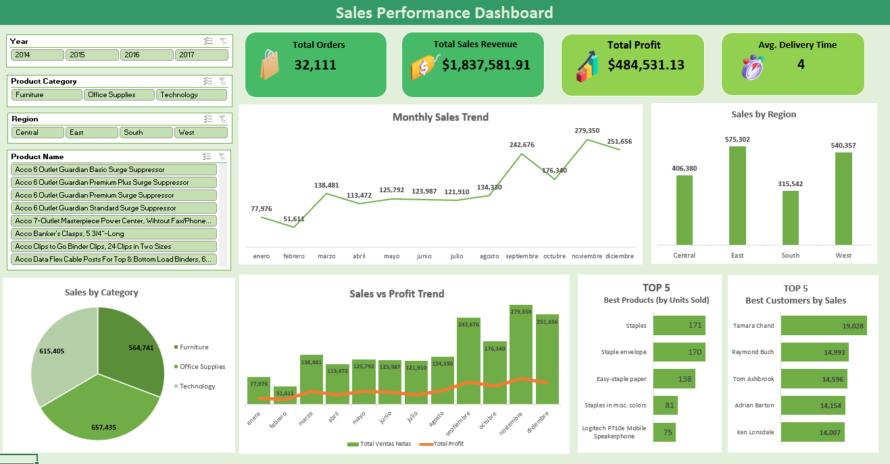

# 📊 Dashboard de Ventas | Sales Dashboard  

## 🌐 Español  

### 🎯 Objetivo  
El propósito de este proyecto es **analizar el rendimiento de las ventas de una empresa ficticia** mediante un **dashboard interactivo en Excel**, permitiendo identificar patrones, productos más vendidos, clientes clave y evolución temporal de las ganancias.  

Este proyecto forma parte de mi **portafolio profesional** y busca demostrar habilidades en:  
- Análisis de datos en Excel  
- ETL con Power Query  
- Modelado de datos con Power Pivot  
- Cálculos avanzados con DAX  
- Diseño de dashboards comerciales  

---

### 🔎 Descripción del Proyecto  
El proyecto sigue un flujo de trabajo completo:  

1. **ETL con Power Query**  
   - Extracción de datos desde múltiples tablas (`t-ventas`, `t-producto`, `t-clientes`, `t-ubicación`).  
   - Limpieza, estandarización y unión de datos.  
   - Creación de columnas calculadas como *Delivery Duration*.  
   - Carga del dataset consolidado en Power Pivot.  

2. **Modelado en Power Pivot**  
   - Creación de relaciones entre tablas.  
   - Implementación de una tabla calendario (`Calendar`) para análisis temporal.  

3. **Medidas DAX creadas**  
   - `Importe Bruto` = Cantidad × Precio Unitario  
   - `Discount Value` = Importe Bruto × % Descuento  
   - `Total Sales` = Importe Bruto – Discount Value  
   - `Profit` = Total Sales – COGS  
   - `Margen %` = Profit / Total Sales  
   - `Average Delivery Duration`  

4. **Dashboard Final**  
   - **KPIs en tarjetas**: Total Orders, Total Sales, Total Profit, Average Delivery Duration  
   - **Segmentadores**: Year, Category, Product Name  
   - **Visualizaciones**:  
     - Ventas Totales por Mes (líneas)  
     - Ventas por Región (barras)  
     - Top 5 Productos más vendidos (barras horizontales, por unidades)  
     - Top 5 Clientes (barras horizontales)  
     - Evolución mensual Ventas vs Profit (gráfico combinado)  
     - Ventas por Categoría (circular)  

---

### 📸 Vista Previa  
  

---

### 📂 Data Sources  
- **t-ventas**: detalle de cada pedido, con fechas, cantidades, precios y descuentos.  
- **t-producto**: catálogo de productos con información de categoría.  
- **t-clientes**: información de clientes.  
- **t-ubicación**: regiones y localizaciones asociadas a los pedidos.  

> Los datos utilizados son ficticios y creados únicamente con fines educativos.  

---

### 🚀 Cómo Usarlo  
1. Descarga el archivo Excel desde este repositorio.  
2. Abre el archivo en **Excel con Power Pivot habilitado**.  
3. Explora el dashboard usando los **segmentadores interactivos** (año, categoría, producto).  

---

### 🛠️ Skills aplicadas  
- Power Query (ETL)  
- Power Pivot (modelado de datos)  
- DAX (medidas y cálculos avanzados)  
- Diseño de dashboards en Excel  
- Análisis de ventas y KPIs  

---

## 🌐 English  

### 🎯 Objective  
The purpose of this project is to **analyze a company’s sales performance** through an **interactive Excel dashboard**, enabling the identification of trends, top-selling products, key customers, and profit evolution over time.  

This project is part of my **professional portfolio** and demonstrates skills in:  
- Data analysis in Excel  
- ETL with Power Query  
- Data modeling with Power Pivot  
- Advanced calculations with DAX  
- Commercial dashboard design  

---

### 🔎 Project Description  
The project follows a complete workflow:  

1. **ETL with Power Query**  
   - Extracted data from multiple tables (`t-ventas`, `t-producto`, `t-clientes`, `t-ubicación`).  
   - Cleaned, standardized, and merged the datasets.  
   - Created calculated columns such as *Delivery Duration*.  
   - Loaded the consolidated dataset into Power Pivot.  

2. **Modeling in Power Pivot**  
   - Built relationships between tables.  
   - Added a calendar table (`Calendar`) for time intelligence analysis.  

3. **DAX Measures Created**  
   - `Gross Amount` = Quantity × Unit Price  
   - `Discount Value` = Gross Amount × % Discount  
   - `Total Sales` = Gross Amount – Discount Value  
   - `Profit` = Total Sales – COGS  
   - `Margin %` = Profit / Total Sales  
   - `Average Delivery Duration`  

4. **Final Dashboard**  
   - **KPI Cards**: Total Orders, Total Sales, Total Profit, Average Delivery Duration  
   - **Slicers**: Year, Category, Product Name  
   - **Visuals**:  
     - Total Sales by Month (line chart)  
     - Sales by Region (bar chart)  
     - Top 5 Best-Selling Products (horizontal bar, by units)  
     - Top 5 Customers (horizontal bar)  
     - Monthly Sales vs Profit Evolution (combo chart)  
     - Sales by Category (pie chart)  

---

### 📸 Preview  
  

---

### 📂 Data Sources  
- **t-ventas (sales)**: details of each order, including dates, quantities, prices, and discounts.  
- **t-producto (products)**: product catalog with category information.  
- **t-clientes (customers)**: customer information.  
- **t-ubicación (location)**: regions and locations associated with the orders.  

> The dataset used is fictitious and created for educational purposes only.  

---

### 🚀 How to Use  
1. Download the Excel file from this repository.  
2. Open it in **Excel with Power Pivot enabled**.  
3. Explore the dashboard using the **interactive slicers** (year, category, product).  

---

### 🛠️ Skills applied  
- Power Query (ETL)  
- Power Pivot (data modeling)  
- DAX (advanced measures and calculations)  
- Dashboard design in Excel  
- Sales analysis and KPIs  
